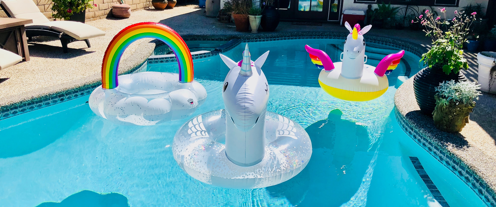

# Pool Party!

[](https://sca.la/typeleveldiscord)
[](https://maven-badges.herokuapp.com/maven-central/org.tpolecat/pool-party_2.13)
[](https://javadoc.io/doc/org.tpolecat/pool-party_2.13)




**Pool Party** is a Scala micro-library that turns a regular `cats.effect.Resource` into a non-blocking, fixed-size pooled resource with optional health checking and event reporting. **This is pre-release software** so it may cause your data center to burn down or (worse) not burn down. Either way it's not my problem.

### Usage

`PooledResourceBuilder` builds a resource that yields a pooled version of some other underlying
resource that you provide.

```scala
val r: Resource[F, Woozle] = ... // A limited resource

PooledResourceBuilder.of(r, 10).build.use { pool =>
  // `pool` has the same apparent behavior as `r`, but will never allow more than
  // 10 concurrent `Woozle`s, which will be recycled and reused on return.
}
```

In most cases you will create a pool when your program starts, and it will not be finalized until the program shuts down. In the common case for a web app your `IOApp.run` will look something like:

```scala
// A server is usually a resource you hang onto until someone hits ^C.
def run(args: List[String]): IO[ExitCode] =
  runResource[IO](args).use(_ => IO.never)

// That resource is the composition of many things, including our pool.
def runResource[F[_]: Temporal: OtherStuff](args: List[String]): Resource[F, ExitCode] =
  for {
    ...
    pool <- PoolBuilder.of(...).withHealthCheck(...).withReporter(...).build
    ...  <- httpServerResource(pool, etc) // request handler can say pool.use
  } yield ExitCode.Success
```

What you **don't** want to do is create a new pool for each request. It's a common error that defeats the purpose of pooling.

### Configuration

In addition to the pool size (required), `PooledResourceBuilder` provides the following configurable properties:

| Property | Type | Explanation |
|---|---|--|
|`HealthCheck` | `A => F[Boolean]` | Check the health of a pooled instance after it's returned to the pool, and perform any necessary cleanup. Yield `false` if the instance should be finalized and discarded. Default behavior always yields `true`. |
|`ShutdownTimeout` | `FiniteDuration` | Amount of time to wait for pooled instances to be finalized when the pool shuts down by leaving `.use` scope. Default is `Long.MaxValue.ns` (~292 years). |
|`Reporter` | `PoolEvent[A] => F[Unit]` | Callback that will receive events about the pool's lifecycle, including error conditions that you probably want to know about. So it's usually a good idea to specify this. The default behavior does nothing. |

Note that the `Reporter` is invoked **synchronously** so it should not do anything time-consuming. A production reporter might enqueue events for later asynchronous processing.

### Getting Help

First check out the [Scaladoc](https://javadoc.io/doc/org.tpolecat/pool-party_2.13), and if you're
still in trouble please open an issue or find me on the [Typelevel Discord](https://sca.la/typeleveldiscord).
